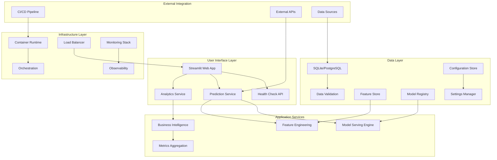
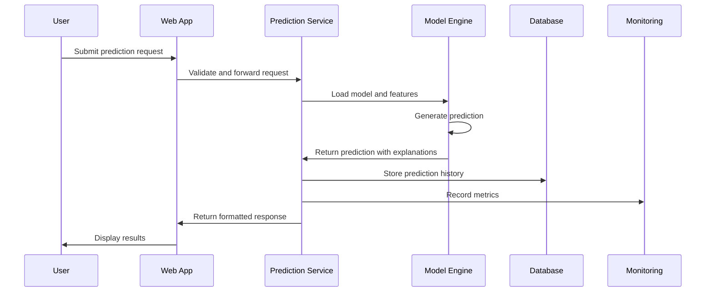
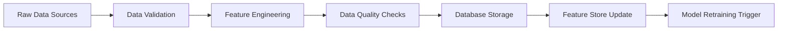
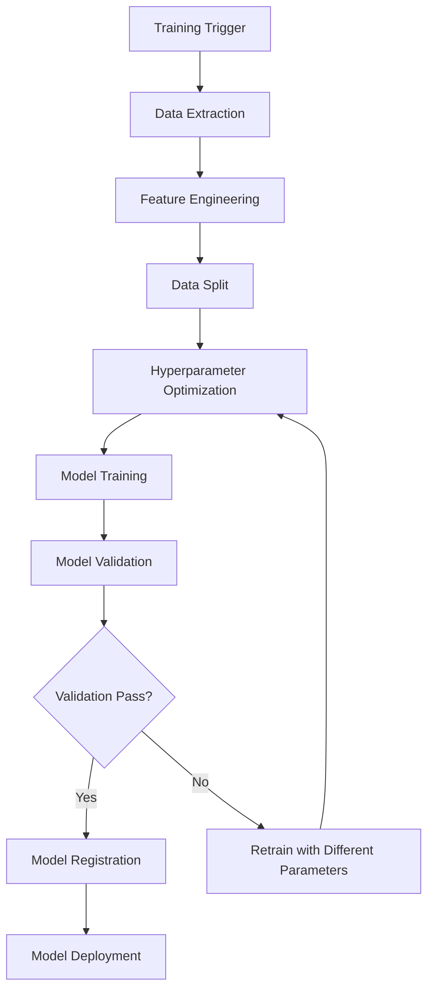

# Architecture Overview - RetentionAI

## Table of Contents

1. [System Architecture](#system-architecture)
2. [Component Overview](#component-overview)
3. [Data Flow](#data-flow)
4. [Infrastructure](#infrastructure)
5. [Security Architecture](#security-architecture)
6. [Scalability & Performance](#scalability--performance)
7. [Deployment Architecture](#deployment-architecture)
8. [Integration Patterns](#integration-patterns)

## System Architecture

RetentionAI follows a modern, cloud-native architecture built on microservices principles with comprehensive observability and automated operations.

### High-Level Architecture



### Core Principles

#### 1. Modularity
- **Separation of Concerns**: Each component handles a specific responsibility
- **Loose Coupling**: Components communicate through well-defined interfaces
- **High Cohesion**: Related functionality is grouped together
- **Pluggable Architecture**: Components can be replaced or upgraded independently

#### 2. Observability
- **Comprehensive Logging**: Structured logging at all levels
- **Metrics Collection**: 20+ custom metrics for monitoring
- **Distributed Tracing**: Request flow tracking across components
- **Health Monitoring**: Proactive system health assessment

#### 3. Scalability
- **Horizontal Scaling**: Scale components independently
- **Stateless Design**: Enable easy scaling and deployment
- **Resource Efficiency**: Optimal resource utilization
- **Performance Optimization**: Sub-500ms response times

#### 4. Reliability
- **Fault Tolerance**: Graceful degradation under failure
- **Data Durability**: Persistent storage with backup strategies
- **High Availability**: 99.9% uptime target
- **Disaster Recovery**: Comprehensive backup and restoration

## Component Overview

### Frontend Layer

#### Streamlit Web Application
- **Purpose**: Interactive user interface for churn prediction
- **Technology**: Streamlit, Python
- **Features**:
  - Real-time prediction interface
  - Data visualization and analytics
  - Batch processing capabilities
  - Administrative controls
- **Deployment**: Containerized with nginx reverse proxy
- **Scaling**: Single instance with session affinity

**Key Files:**
- `src/app.py` - Main application entry point
- `src/dashboard_utils.py` - UI helper functions
- `src/visualization.py` - Chart and graph generation

### API Layer

#### Health Check Endpoints
- **Purpose**: System health monitoring and readiness checks
- **Technology**: FastAPI, Python
- **Endpoints**:
  - `/health` - Overall system health
  - `/ready` - Application readiness
  - `/live` - Liveness probe
  - `/metrics` - Prometheus metrics endpoint
- **Integration**: Kubernetes health checks, monitoring systems

**Implementation:**
```python
# src/health_endpoints.py
@app.get("/health")
async def health_check():
    return {
        "status": "healthy",
        "timestamp": datetime.utcnow(),
        "components": await check_all_components()
    }
```

#### Prediction Service
- **Purpose**: ML model serving and prediction generation
- **Technology**: Scikit-learn, XGBoost, SHAP
- **Features**:
  - Single customer prediction
  - Batch prediction processing
  - SHAP explanations
  - Model versioning
- **Performance**: <20ms average response time

### Data Layer

#### Database Management
- **Primary Database**: SQLite (development), PostgreSQL (production)
- **Purpose**: Customer data storage, prediction history, system configuration
- **Schema**:
  - `customers` - Customer profile data
  - `predictions` - Historical predictions and outcomes
  - `models` - Model metadata and versions
  - `system_config` - Application configuration

**Database Schema:**
```sql
-- customers table
CREATE TABLE customers (
    customer_id VARCHAR(50) PRIMARY KEY,
    gender VARCHAR(10),
    senior_citizen INTEGER,
    partner VARCHAR(5),
    dependents VARCHAR(5),
    tenure INTEGER,
    phone_service VARCHAR(5),
    multiple_lines VARCHAR(20),
    internet_service VARCHAR(20),
    online_security VARCHAR(20),
    online_backup VARCHAR(20),
    device_protection VARCHAR(20),
    tech_support VARCHAR(20),
    streaming_tv VARCHAR(20),
    streaming_movies VARCHAR(20),
    contract VARCHAR(20),
    paperless_billing VARCHAR(5),
    payment_method VARCHAR(50),
    monthly_charges DECIMAL(8,2),
    total_charges DECIMAL(10,2),
    created_at TIMESTAMP DEFAULT CURRENT_TIMESTAMP,
    updated_at TIMESTAMP DEFAULT CURRENT_TIMESTAMP
);

-- predictions table
CREATE TABLE predictions (
    prediction_id SERIAL PRIMARY KEY,
    customer_id VARCHAR(50),
    churn_probability DECIMAL(5,4),
    prediction VARCHAR(5),
    confidence_level VARCHAR(10),
    model_version VARCHAR(20),
    prediction_date TIMESTAMP DEFAULT CURRENT_TIMESTAMP,
    FOREIGN KEY (customer_id) REFERENCES customers(customer_id)
);
```

#### Feature Store
- **Purpose**: Centralized feature management and serving
- **Implementation**: File-based with caching layer
- **Features**:
  - Feature versioning and lineage
  - Real-time feature computation
  - Feature drift detection
  - Data validation

### ML Pipeline

#### Model Training Pipeline
- **Technology**: XGBoost, CatBoost, Optuna
- **Process**:
  1. Data ingestion and validation
  2. Feature engineering and selection
  3. Model training with hyperparameter optimization
  4. Model validation and testing
  5. Model registration and deployment
- **Automation**: Scheduled retraining, drift detection triggers

**Training Flow:**
```python
# src/model_trainer.py
class ModelTrainer:
    def train_pipeline(self):
        # 1. Data preparation
        X_train, y_train = self.prepare_training_data()
        
        # 2. Feature engineering
        X_train = self.feature_engineer.transform(X_train)
        
        # 3. Hyperparameter optimization
        best_params = self.optimize_hyperparameters(X_train, y_train)
        
        # 4. Model training
        model = self.train_model(X_train, y_train, best_params)
        
        # 5. Model validation
        metrics = self.validate_model(model)
        
        # 6. Model registration
        self.register_model(model, metrics)
```

#### Model Serving Engine
- **Purpose**: Production model serving and inference
- **Features**:
  - Model loading and caching
  - Prediction generation
  - Model versioning
  - A/B testing support
- **Performance**: Optimized for low latency

### Monitoring & Observability

#### Prometheus Metrics Collection
- **Application Metrics**:
  - Request rates and response times
  - Prediction accuracy and drift
  - User activity and engagement
  - Error rates and types

- **Infrastructure Metrics**:
  - CPU, memory, and disk usage
  - Network throughput
  - Container health
  - Database performance

**Custom Metrics:**
```python
# src/monitoring.py
from prometheus_client import Counter, Histogram, Gauge

# Application metrics
prediction_requests = Counter('retentionai_prediction_requests_total')
prediction_latency = Histogram('retentionai_prediction_duration_seconds')
model_accuracy = Gauge('retentionai_model_accuracy')
high_risk_customers = Gauge('retentionai_high_risk_customers_total')
```

#### Grafana Dashboards
- **System Overview**: High-level system health and performance
- **ML Metrics**: Model performance and prediction analytics
- **Business Metrics**: Customer risk distribution and business impact
- **Infrastructure**: Resource utilization and capacity planning

#### Alerting System
- **Alert Manager**: Prometheus AlertManager integration
- **Notification Channels**: Email, Slack, webhooks
- **Alert Types**:
  - Model performance degradation
  - High error rates
  - Resource exhaustion
  - Business threshold breaches

## Data Flow

### Prediction Request Flow



### Data Ingestion Flow



### Model Training Flow



## Infrastructure

### Container Architecture

#### Multi-Stage Docker Builds
```dockerfile
# Production Dockerfile structure
FROM python:3.10-slim as base
# Base dependencies and user setup

FROM base as dependencies
# Install Python packages

FROM base as runtime
# Copy application code and dependencies
```

#### Container Orchestration
- **Development**: Docker Compose
- **Production**: Kubernetes with Helm charts
- **Service Mesh**: Istio (optional for advanced deployments)

### Kubernetes Deployment

#### Core Components
```yaml
# Deployment configuration
apiVersion: apps/v1
kind: Deployment
metadata:
  name: retentionai-app
spec:
  replicas: 3
  selector:
    matchLabels:
      app: retentionai
  template:
    spec:
      containers:
      - name: app
        image: retentionai:latest
        resources:
          requests:
            cpu: 100m
            memory: 512Mi
          limits:
            cpu: 500m
            memory: 2Gi
```

#### Scaling Strategy
- **Horizontal Pod Autoscaler**: Scale based on CPU/memory usage
- **Vertical Pod Autoscaler**: Optimize resource requests
- **Cluster Autoscaler**: Scale cluster nodes as needed

### Networking

#### Service Architecture
- **ClusterIP**: Internal service communication
- **LoadBalancer**: External traffic routing
- **Ingress**: HTTP/HTTPS routing with SSL termination
- **Network Policies**: Traffic security and isolation

#### Load Balancing
- **Application Load Balancer**: Layer 7 routing
- **Health Check Integration**: Automatic unhealthy instance removal
- **SSL Termination**: TLS encryption handling
- **Rate Limiting**: Protection against abuse

## Security Architecture

### Authentication & Authorization

#### Session Management
- **Session-based Authentication**: Secure session handling
- **JWT Tokens**: API authentication (future implementation)
- **Role-Based Access Control**: User permission management
- **Multi-Factor Authentication**: Enhanced security (enterprise)

#### API Security
```python
# Security middleware implementation
@app.middleware("http")
async def security_middleware(request: Request, call_next):
    # Rate limiting
    await rate_limiter.check(request.client.host)
    
    # Authentication check
    if not await authenticate_request(request):
        return Response(status_code=401)
    
    response = await call_next(request)
    
    # Security headers
    response.headers["X-Content-Type-Options"] = "nosniff"
    response.headers["X-Frame-Options"] = "DENY"
    response.headers["X-XSS-Protection"] = "1; mode=block"
    
    return response
```

### Data Security

#### Encryption
- **Data at Rest**: Database encryption with AES-256
- **Data in Transit**: TLS 1.3 for all communications
- **Secret Management**: Kubernetes secrets, external key management
- **Key Rotation**: Automated certificate and key rotation

#### Data Privacy
- **PII Protection**: Anonymization and pseudonymization
- **Data Retention**: Automated data lifecycle management
- **Audit Logging**: Comprehensive access and change logging
- **Compliance**: GDPR, CCPA compliance frameworks

### Network Security

#### Firewall Rules
```yaml
# Network policy example
apiVersion: networking.k8s.io/v1
kind: NetworkPolicy
metadata:
  name: retentionai-network-policy
spec:
  podSelector:
    matchLabels:
      app: retentionai
  policyTypes:
  - Ingress
  - Egress
  ingress:
  - from:
    - podSelector:
        matchLabels:
          role: frontend
    ports:
    - protocol: TCP
      port: 8501
```

#### Container Security
- **Base Image Scanning**: Vulnerability assessment
- **Runtime Security**: Container runtime protection
- **Least Privilege**: Minimal container permissions
- **Image Signing**: Container image integrity verification

## Scalability & Performance

### Horizontal Scaling

#### Stateless Design
- **No Server-Side State**: All state externalized
- **Session Externalization**: Redis/database session storage
- **Shared Nothing Architecture**: Independent scaling units

#### Auto-Scaling Configuration
```yaml
apiVersion: autoscaling/v2
kind: HorizontalPodAutoscaler
metadata:
  name: retentionai-hpa
spec:
  scaleTargetRef:
    apiVersion: apps/v1
    kind: Deployment
    name: retentionai-app
  minReplicas: 2
  maxReplicas: 10
  metrics:
  - type: Resource
    resource:
      name: cpu
      target:
        type: Utilization
        averageUtilization: 70
  - type: Resource
    resource:
      name: memory
      target:
        type: Utilization
        averageUtilization: 80
```

### Performance Optimization

#### Caching Strategy
- **Application Cache**: In-memory caching for frequently accessed data
- **Model Cache**: Loaded models cached in memory
- **Database Cache**: Query result caching
- **CDN**: Static asset delivery optimization

#### Database Optimization
- **Index Strategy**: Optimized database indexes
- **Query Optimization**: Efficient query patterns
- **Connection Pooling**: Database connection management
- **Read Replicas**: Read scaling for analytics queries

### Resource Management

#### Resource Allocation
```yaml
resources:
  requests:
    cpu: 100m        # Minimum CPU guaranteed
    memory: 512Mi    # Minimum memory guaranteed
  limits:
    cpu: 500m        # Maximum CPU allowed
    memory: 2Gi      # Maximum memory allowed
```

#### Quality of Service
- **Guaranteed**: Critical components with resource guarantees
- **Burstable**: Most components with baseline requests
- **BestEffort**: Non-critical components without guarantees

## Deployment Architecture

### Environment Strategy

#### Development Environment
- **Local Development**: Docker Compose
- **Feature Branches**: Automatic PR environments
- **Shared Development**: Single development cluster
- **Data**: Synthetic or anonymized test data

#### Staging Environment
- **Production Mirror**: Identical to production configuration
- **Integration Testing**: Full system testing
- **Performance Testing**: Load and stress testing
- **Security Testing**: Vulnerability and penetration testing

#### Production Environment
- **High Availability**: Multi-zone deployment
- **Disaster Recovery**: Cross-region backup
- **Monitoring**: Comprehensive observability
- **Backup Strategy**: Automated backup and restoration

### CI/CD Pipeline

#### Continuous Integration
```yaml
# GitHub Actions workflow
name: CI Pipeline
on: [push, pull_request]

jobs:
  test:
    runs-on: ubuntu-latest
    steps:
    - uses: actions/checkout@v3
    - name: Set up Python
      uses: actions/setup-python@v4
      with:
        python-version: 3.10
    - name: Install dependencies
      run: pip install -r requirements.txt
    - name: Run tests
      run: pytest tests/ -v
    - name: Security scan
      run: bandit -r src/
    - name: Code quality
      run: |
        ruff check src/
        black --check src/
```

#### Continuous Deployment
- **Automated Testing**: Unit, integration, and security tests
- **Progressive Deployment**: Blue-green and canary deployments
- **Rollback Strategy**: Automatic rollback on failure detection
- **Feature Flags**: Controlled feature rollouts

### Monitoring Integration

#### Health Check Integration
```yaml
# Kubernetes health checks
livenessProbe:
  httpGet:
    path: /live
    port: 8501
  initialDelaySeconds: 30
  periodSeconds: 10

readinessProbe:
  httpGet:
    path: /ready
    port: 8501
  initialDelaySeconds: 5
  periodSeconds: 5
```

#### Prometheus Integration
- **Service Discovery**: Automatic target discovery
- **Metric Collection**: Custom application metrics
- **Alert Rules**: Performance and business alerts
- **Grafana Dashboards**: Visual monitoring interfaces

## Integration Patterns

### External System Integration

#### CRM Integration
```python
# CRM connector example
class CRMIntegration:
    def sync_customer_data(self):
        customers = self.crm_client.get_customers()
        for customer in customers:
            self.update_customer_profile(customer)
    
    def send_retention_alert(self, customer_id, risk_score):
        self.crm_client.create_task({
            'customer_id': customer_id,
            'type': 'retention_call',
            'priority': self.get_priority(risk_score)
        })
```

#### API Gateway Pattern
- **Centralized Routing**: Single entry point for all API calls
- **Authentication**: Centralized authentication and authorization
- **Rate Limiting**: Global rate limiting and throttling
- **Request/Response Transformation**: Data format standardization

### Event-Driven Architecture

#### Event Sourcing
- **Event Store**: Immutable event log
- **Event Replay**: System state reconstruction
- **Event Projection**: Read-optimized views
- **Saga Pattern**: Distributed transaction management

#### Message Queuing
- **Async Processing**: Background job processing
- **Event Notification**: Real-time event distribution
- **Retry Logic**: Reliable message delivery
- **Dead Letter Queues**: Failed message handling

### Data Integration

#### ETL Pipeline
```python
# ETL pipeline structure
class ETLPipeline:
    def extract(self, source):
        # Extract data from various sources
        pass
    
    def transform(self, raw_data):
        # Apply business rules and transformations
        pass
    
    def load(self, transformed_data):
        # Load into target systems
        pass
    
    def run(self):
        raw_data = self.extract(self.data_source)
        clean_data = self.transform(raw_data)
        self.load(clean_data)
```

#### Real-time Streaming
- **Change Data Capture**: Database change streaming
- **Event Streaming**: Real-time event processing
- **Stream Processing**: Real-time analytics and alerts
- **Backpressure Handling**: System overload protection

---

*This architecture is designed to be production-ready, scalable, and maintainable while following industry best practices for cloud-native applications.*