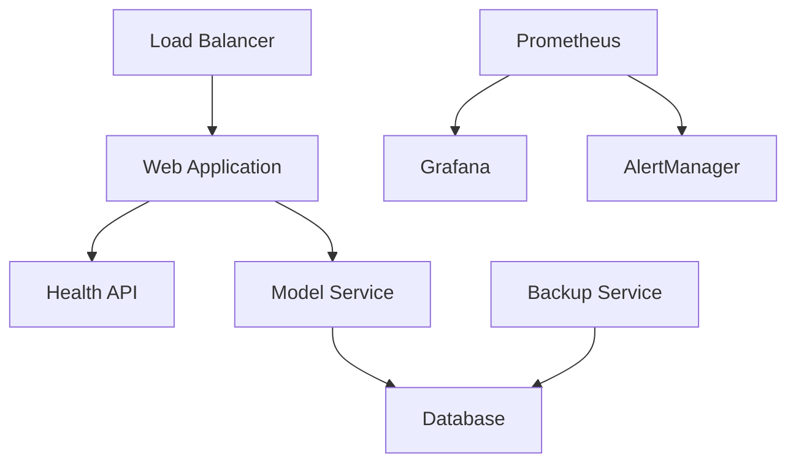

# Operations Runbook - RetentionAI

## Table of Contents

1. [System Overview](#system-overview)
2. [Operational Procedures](#operational-procedures)
3. [Monitoring & Alerting](#monitoring--alerting)
4. [Incident Response](#incident-response)
5. [Maintenance Procedures](#maintenance-procedures)
6. [Backup & Recovery](#backup--recovery)
7. [Security Operations](#security-operations)
8. [Performance Management](#performance-management)

## System Overview

### Service Architecture

RetentionAI consists of the following core services:

| Service | Purpose | Health Check | Dependencies |
|---------|---------|--------------|--------------|
| **Web App** | Streamlit frontend | `/health` | Database, Model Service |
| **Health API** | System monitoring | `/live`, `/ready` | None |
| **Database** | Data persistence | Connection test | None |
| **Model Service** | ML predictions | Model loading check | Database |
| **Monitoring** | Observability stack | Prometheus `/metrics` | All services |

### System Dependencies



### Key Metrics

| Metric | Normal Range | Warning Threshold | Critical Threshold |
|--------|--------------|-------------------|-------------------|
| **Response Time** | <200ms | >500ms | >1000ms |
| **CPU Usage** | <50% | >70% | >90% |
| **Memory Usage** | <60% | >80% | >95% |
| **Disk Usage** | <70% | >85% | >95% |
| **Error Rate** | <0.1% | >1% | >5% |
| **Model Accuracy** | >85% | <80% | <75% |

## Operational Procedures

### Daily Operations

#### Morning Health Check (9:00 AM)

1. **System Status Verification**
   ```bash
   # Check overall system health
   curl -f http://localhost:8501/health
   
   # Verify all services are running
   docker-compose ps
   # OR for Kubernetes
   kubectl get pods -l app=retentionai
   ```

2. **Performance Review**
   - Open Grafana dashboard: http://localhost:3000
   - Review overnight metrics and alerts
   - Check prediction volume and accuracy trends
   - Verify backup completion status

3. **Alert Review**
   ```bash
   # Check recent alerts
   curl http://localhost:9093/api/v1/alerts
   
   # Review alert history
   grep "ALERT" /var/log/retentionai/alerts.log
   ```

#### End-of-Day Review (6:00 PM)

1. **Daily Metrics Summary**
   - Total predictions processed
   - Average response time
   - Error count and types
   - High-risk customer alerts generated

2. **Resource Usage Check**
   ```bash
   # System resource usage
   df -h                    # Disk usage
   free -h                  # Memory usage
   top -n 1 | head -20     # CPU usage
   ```

3. **Log Review**
   ```bash
   # Check for errors in application logs
   tail -100 /var/log/retentionai/app.log | grep ERROR
   
   # Review access logs for anomalies
   tail -100 /var/log/nginx/access.log
   ```

### Weekly Operations

#### Monday: System Maintenance

1. **Log Rotation and Cleanup**
   ```bash
   # Archive old logs
   ./scripts/log_cleanup.sh
   
   # Clear temporary files
   find /tmp -name "retentionai_*" -mtime +7 -delete
   ```

2. **Database Maintenance**
   ```bash
   # Database optimization
   python src/database_maintenance.py --optimize
   
   # Clean old prediction records (>90 days)
   python src/database_maintenance.py --cleanup-predictions
   ```

3. **Model Performance Review**
   - Review weekly model accuracy trends
   - Check for concept drift indicators
   - Evaluate need for model retraining

#### Wednesday: Security Review

1. **Security Scan**
   ```bash
   # Run security vulnerability scan
   bandit -r src/ -f json -o security_report.json
   
   # Check for dependency vulnerabilities
   safety check --json
   ```

2. **Access Log Analysis**
   ```bash
   # Analyze access patterns
   python scripts/analyze_access_logs.py
   
   # Check for suspicious activity
   grep "40[14]" /var/log/nginx/access.log
   ```

#### Friday: Capacity Planning

1. **Resource Trend Analysis**
   - Review weekly resource usage trends
   - Predict next month's capacity needs
   - Plan for seasonal demand variations

2. **Performance Optimization**
   ```bash
   # Run performance tests
   ./scripts/load_test.sh baseline
   
   # Analyze database query performance
   python scripts/query_analysis.py
   ```

### Monthly Operations

#### First Monday: Full System Review

1. **Comprehensive Health Assessment**
   ```bash
   # Full system validation
   ./scripts/validate.sh comprehensive
   
   # Performance benchmark
   ./scripts/load_test.sh full
   ```

2. **Business Metrics Review**
   - Model ROI analysis
   - Customer retention impact assessment
   - User engagement metrics review

3. **Infrastructure Planning**
   - Review scaling requirements
   - Evaluate new feature impacts
   - Plan maintenance windows

## Monitoring & Alerting

### Alert Severity Levels

#### Critical Alerts (Immediate Response Required)

| Alert | Condition | Response Time | Action |
|-------|-----------|---------------|---------|
| **Service Down** | Health check fails | <5 minutes | Page on-call engineer |
| **High Error Rate** | >5% error rate for 5 minutes | <5 minutes | Investigate and mitigate |
| **Model Failure** | Model loading/prediction fails | <10 minutes | Restart service, check logs |
| **Database Down** | Database connection lost | <5 minutes | Check DB status, restart if needed |
| **Security Breach** | Suspicious access detected | <2 minutes | Isolate system, investigate |

#### Warning Alerts (Response Within 1 Hour)

| Alert | Condition | Response Time | Action |
|-------|-----------|---------------|---------|
| **High CPU Usage** | >70% CPU for 15 minutes | <1 hour | Monitor, scale if needed |
| **High Memory Usage** | >80% memory for 15 minutes | <1 hour | Investigate memory leaks |
| **Slow Response** | >500ms average for 10 minutes | <1 hour | Performance investigation |
| **Model Accuracy Drop** | <80% accuracy for 24 hours | <1 hour | Plan model retraining |
| **Disk Space Low** | >85% disk usage | <1 hour | Clean up logs, plan expansion |

#### Info Alerts (Response Within 24 Hours)

| Alert | Condition | Response Time | Action |
|-------|-----------|---------------|---------|
| **Backup Failed** | Backup job failure | <24 hours | Retry backup, investigate |
| **High Prediction Volume** | >150% normal volume | <24 hours | Monitor capacity |
| **Certificate Expiry** | SSL cert expires in 30 days | <24 hours | Renew certificate |

### Monitoring Dashboard URLs

- **Primary Dashboard**: http://monitoring.retentionai.com:3000/d/main
- **System Metrics**: http://monitoring.retentionai.com:3000/d/system
- **ML Metrics**: http://monitoring.retentionai.com:3000/d/ml
- **Business Metrics**: http://monitoring.retentionai.com:3000/d/business

### Key Performance Indicators (KPIs)

#### Technical KPIs
```prometheus
# Service availability
up{job="retentionai"} * 100

# Average response time
rate(retentionai_request_duration_seconds_sum[5m]) / 
rate(retentionai_request_duration_seconds_count[5m])

# Error rate
rate(retentionai_requests_total{status=~"5.."}[5m]) / 
rate(retentionai_requests_total[5m])

# Model accuracy
retentionai_model_accuracy
```

#### Business KPIs
```prometheus
# High-risk customers
retentionai_high_risk_customers_total

# Prediction volume
rate(retentionai_predictions_total[1h])

# Model deployment frequency
increase(retentionai_model_deployments_total[1d])
```

## Incident Response

### Incident Classification

#### Severity 1 (Critical)
- **Definition**: Service completely down, data loss, security breach
- **Response Time**: 15 minutes
- **Escalation**: Immediately page on-call engineer
- **Communication**: Update status page within 30 minutes

#### Severity 2 (High)
- **Definition**: Major functionality impaired, significant performance degradation
- **Response Time**: 1 hour
- **Escalation**: Notify team lead within 30 minutes
- **Communication**: Update status page within 2 hours

#### Severity 3 (Medium)
- **Definition**: Minor functionality impaired, workarounds available
- **Response Time**: 4 hours during business hours
- **Escalation**: Create ticket, assign to appropriate team
- **Communication**: Include in next status update

### Incident Response Procedures

#### Step 1: Initial Response
```bash
# Immediate assessment
./scripts/health_check.sh

# Check service status
docker-compose ps
# OR
kubectl get pods -l app=retentionai

# Check recent logs
tail -50 /var/log/retentionai/app.log
```

#### Step 2: Diagnosis
1. **Identify the scope of impact**
   - Which services are affected?
   - How many users are impacted?
   - What functionality is unavailable?

2. **Collect diagnostic information**
   ```bash
   # System metrics
   ./scripts/collect_diagnostics.sh
   
   # Recent changes
   git log --oneline -10
   
   # Database status
   python scripts/db_health_check.py
   ```

#### Step 3: Mitigation
1. **Immediate mitigation strategies**
   ```bash
   # Restart services
   docker-compose restart
   # OR
   kubectl rollout restart deployment/retentionai-app
   
   # Rollback recent deployment
   kubectl rollout undo deployment/retentionai-app
   
   # Scale up resources
   kubectl scale deployment/retentionai-app --replicas=5
   ```

2. **Communication**
   - Update incident ticket with findings
   - Notify stakeholders of progress
   - Update status page if customer-facing

#### Step 4: Resolution
1. **Implement permanent fix**
2. **Validate fix in staging**
3. **Deploy fix to production**
4. **Monitor for recurring issues**

#### Step 5: Post-Incident Review
1. **Document timeline**
2. **Root cause analysis**
3. **Action items for prevention**
4. **Update runbooks based on learnings**

### Common Incident Scenarios

#### Application Won't Start

**Symptoms:**
- Health check endpoints return 503
- Container restart loops
- Database connection errors

**Diagnosis Steps:**
```bash
# Check container logs
docker logs retentionai_app_1

# Check environment variables
env | grep RETENTIONAI

# Test database connectivity
python -c "import sqlite3; sqlite3.connect('data/retentionai.db')"
```

**Resolution:**
1. Verify database file permissions
2. Check configuration file syntax
3. Ensure all required environment variables are set
4. Restart with proper configuration

#### High Memory Usage

**Symptoms:**
- Memory usage >90%
- Slow response times
- Out of memory errors in logs

**Diagnosis Steps:**
```bash
# Check memory usage by process
ps aux --sort=-%mem | head -20

# Check for memory leaks
python scripts/memory_profiler.py

# Review model loading patterns
grep "Loading model" /var/log/retentionai/app.log
```

**Resolution:**
1. Restart application to clear memory
2. Scale up memory limits
3. Optimize model loading
4. Implement memory monitoring

#### Model Prediction Failures

**Symptoms:**
- Prediction API returns errors
- Model loading failures
- SHAP explanation errors

**Diagnosis Steps:**
```bash
# Test model loading
python -c "import joblib; joblib.load('models/best_model.pkl')"

# Check model file integrity
ls -la models/
md5sum models/best_model.pkl

# Review feature engineering logs
grep "Feature engineering" /var/log/retentionai/app.log
```

**Resolution:**
1. Verify model file integrity
2. Reload model from backup
3. Check feature engineering pipeline
4. Restart model service

## Maintenance Procedures

### Scheduled Maintenance Windows

#### Weekly Maintenance (Sundays 2:00-4:00 AM)
- System updates and patches
- Database optimization
- Log rotation and cleanup
- Backup verification

#### Monthly Maintenance (First Sunday 1:00-6:00 AM)
- Major system updates
- Infrastructure scaling
- Security updates
- Performance optimization

### Pre-Maintenance Checklist

```bash
# 1. Announce maintenance window
echo "Maintenance starting at $(date)" | mail -s "Maintenance Alert" ops@company.com

# 2. Create backup
./scripts/backup.sh full

# 3. Verify staging environment
./scripts/deploy.sh staging
./scripts/validate.sh staging

# 4. Document current state
./scripts/system_snapshot.sh
```

### Post-Maintenance Checklist

```bash
# 1. Validate system functionality
./scripts/validate.sh production

# 2. Run smoke tests
./scripts/smoke_tests.sh

# 3. Check monitoring systems
curl http://localhost:9090/api/v1/query?query=up

# 4. Announce completion
echo "Maintenance completed at $(date)" | mail -s "Maintenance Complete" ops@company.com
```

### Update Procedures

#### Application Updates
1. **Deploy to staging**
   ```bash
   git checkout release/v1.2.0
   ./scripts/deploy.sh staging
   ./scripts/validate.sh staging
   ```

2. **Run regression tests**
   ```bash
   pytest tests/ -m "not slow"
   ./scripts/load_test.sh baseline
   ```

3. **Deploy to production**
   ```bash
   ./scripts/deploy.sh production
   ./scripts/validate.sh production
   ```

#### Model Updates
1. **Validate new model**
   ```bash
   python src/model_validator.py --model=models/new_model.pkl
   ```

2. **A/B test setup**
   ```bash
   # Deploy challenger model
   cp models/new_model.pkl models/challenger_model.pkl
   
   # Enable A/B testing
   python scripts/enable_ab_test.py --split=0.1
   ```

3. **Monitor performance**
   - Compare accuracy metrics
   - Monitor response times
   - Check for prediction drift

4. **Promote or rollback**
   ```bash
   # Promote if successful
   python scripts/promote_model.py --model=challenger
   
   # Or rollback if issues
   python scripts/rollback_model.py
   ```

## Backup & Recovery

### Backup Strategy

#### Daily Backups (Automated)
- **Database**: Full database dump
- **Models**: Model artifacts and metadata
- **Configuration**: Application configuration files
- **Logs**: Application and system logs

```bash
#!/bin/bash
# Daily backup script
DATE=$(date +%Y-%m-%d)
BACKUP_DIR="/backups/daily/$DATE"

mkdir -p "$BACKUP_DIR"

# Database backup
sqlite3 data/retentionai.db ".backup $BACKUP_DIR/database.db"

# Model backup
tar -czf "$BACKUP_DIR/models.tar.gz" models/

# Configuration backup
tar -czf "$BACKUP_DIR/config.tar.gz" config/

# Logs backup
tar -czf "$BACKUP_DIR/logs.tar.gz" /var/log/retentionai/
```

#### Weekly Backups (Automated)
- **Full System**: Complete system snapshot
- **Documentation**: All documentation and runbooks
- **Scripts**: All operational scripts and tools

#### Monthly Backups (Manual)
- **Archive**: Archive old daily backups
- **Offsite**: Copy backups to remote location
- **Verification**: Restore testing in isolated environment

### Recovery Procedures

#### Database Recovery
```bash
# Stop application
docker-compose stop app

# Restore database from backup
cp /backups/daily/2025-11-22/database.db data/retentionai.db

# Start application
docker-compose start app

# Verify data integrity
python scripts/verify_data.py
```

#### Model Recovery
```bash
# Restore models from backup
tar -xzf /backups/daily/2025-11-22/models.tar.gz

# Verify model functionality
python scripts/test_model.py --model=models/best_model.pkl

# Restart model service
docker-compose restart app
```

#### Full System Recovery
```bash
# 1. Prepare clean environment
./scripts/clean_environment.sh

# 2. Restore application code
git clone https://github.com/Saksham932007/RetentionAI.git
cd RetentionAI

# 3. Restore data and configuration
tar -xzf /backups/daily/2025-11-22/config.tar.gz
tar -xzf /backups/daily/2025-11-22/models.tar.gz
cp /backups/daily/2025-11-22/database.db data/

# 4. Deploy application
./scripts/deploy.sh production

# 5. Validate recovery
./scripts/validate.sh production
```

### Disaster Recovery

#### RTO/RPO Targets
- **Recovery Time Objective (RTO)**: 4 hours
- **Recovery Point Objective (RPO)**: 1 hour
- **Data Loss Tolerance**: <1 hour of predictions

#### DR Site Setup
1. **Secondary Infrastructure**: Mirror production environment
2. **Data Replication**: Real-time database replication
3. **Model Synchronization**: Automatic model artifact sync
4. **DNS Failover**: Automatic traffic redirection

## Security Operations

### Security Monitoring

#### Real-Time Monitoring
```bash
# Monitor failed authentication attempts
tail -f /var/log/retentionai/auth.log | grep "FAILED"

# Check for unusual access patterns
python scripts/security_monitor.py --realtime

# Monitor system file changes
auditctl -w /etc/retentionai/ -p wa -k config_changes
```

#### Daily Security Checks
```bash
# Check for new vulnerabilities
safety check

# Scan for malware
clamav-scan /opt/retentionai/

# Review access logs
python scripts/access_log_analysis.py --date=today
```

### Security Incident Response

#### Suspected Breach
1. **Immediate Actions**
   ```bash
   # Isolate affected systems
   iptables -A INPUT -s <suspicious_ip> -j DROP
   
   # Preserve evidence
   cp -r /var/log/retentionai/ /forensics/$(date +%Y%m%d_%H%M%S)/
   
   # Change passwords
   python scripts/rotate_credentials.py
   ```

2. **Investigation**
   - Review access logs
   - Check for data exfiltration
   - Identify attack vector
   - Assess damage scope

3. **Recovery**
   - Patch vulnerabilities
   - Restore from clean backups
   - Update security policies
   - Implement additional monitoring

### Compliance Procedures

#### GDPR Compliance
```bash
# Data subject access request
python scripts/gdpr_export.py --customer-id=<customer_id>

# Right to be forgotten
python scripts/gdpr_delete.py --customer-id=<customer_id>

# Data processing audit
python scripts/gdpr_audit.py --month=2025-11
```

#### SOC 2 Compliance
- Monthly access reviews
- Quarterly security training
- Annual penetration testing
- Continuous monitoring documentation

## Performance Management

### Performance Monitoring

#### Real-Time Metrics
```bash
# Application performance
curl http://localhost:8501/metrics | grep retentionai_request_duration

# System performance
iostat -x 1 5    # Disk I/O
vmstat 1 5       # Memory and CPU
netstat -i       # Network interface stats
```

#### Performance Baselines
| Metric | Baseline | Target | Alert |
|--------|----------|---------|--------|
| **Response Time** | 150ms | <200ms | >500ms |
| **Throughput** | 50 req/s | >100 req/s | <20 req/s |
| **CPU Usage** | 25% | <50% | >70% |
| **Memory Usage** | 40% | <60% | >80% |
| **Model Latency** | 15ms | <20ms | >50ms |

### Performance Optimization

#### Application Optimization
```python
# Profile application performance
python -m cProfile -o profile.stats src/app.py

# Memory profiling
python -m memory_profiler src/model_trainer.py

# Database query optimization
python scripts/analyze_queries.py --slow-threshold=1000
```

#### Infrastructure Optimization
```bash
# Docker container optimization
docker stats

# Kubernetes resource optimization
kubectl top pods
kubectl describe hpa retentionai-hpa

# Network optimization
iftop -i eth0
```

### Capacity Planning

#### Monthly Capacity Review
1. **Resource Usage Trends**
   - CPU, memory, disk, network utilization
   - Growth rate calculations
   - Seasonal pattern analysis

2. **Prediction Volume Analysis**
   - Daily/weekly prediction volumes
   - Peak usage periods
   - Business growth projections

3. **Scaling Recommendations**
   - Short-term scaling needs (1-3 months)
   - Long-term capacity requirements (6-12 months)
   - Cost optimization opportunities

#### Scaling Triggers
```yaml
# Auto-scaling configuration
metrics:
  - type: Resource
    resource:
      name: cpu
      target:
        type: Utilization
        averageUtilization: 70
  - type: Custom
    custom:
      metric:
        name: retentionai_requests_per_second
      target:
        type: AverageValue
        averageValue: "100"
```

### Contact Information

#### On-Call Rotation
- **Primary**: ops-primary@company.com
- **Secondary**: ops-secondary@company.com
- **Escalation**: ops-manager@company.com

#### Emergency Contacts
- **Security Incident**: security@company.com
- **Infrastructure**: infrastructure@company.com
- **Business Continuity**: bcp@company.com

#### Vendor Support
- **Cloud Provider**: support.cloud-provider.com
- **Monitoring Vendor**: support@monitoring-vendor.com
- **Database Support**: db-support@vendor.com

---

*This runbook should be reviewed and updated quarterly to ensure accuracy and completeness.*